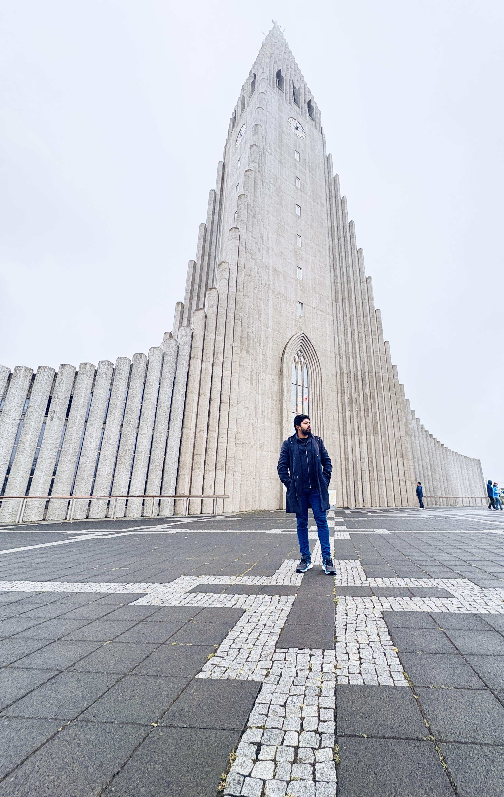
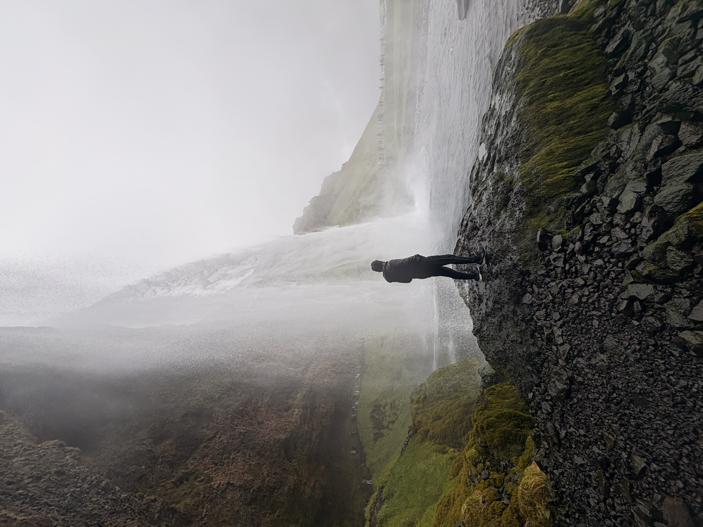
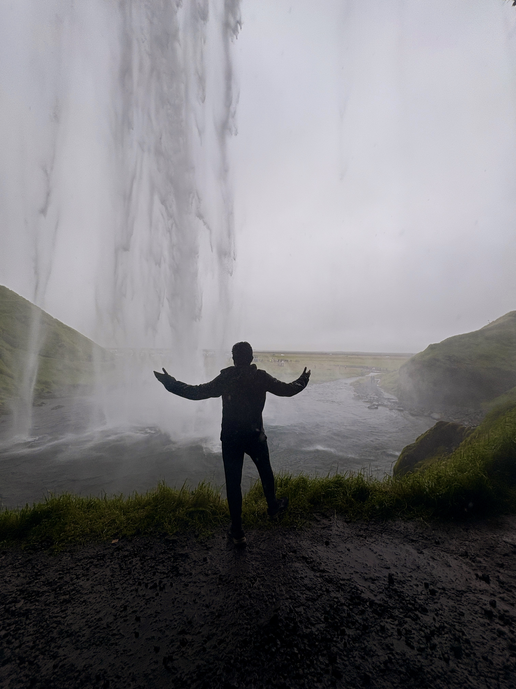

In August 2025, we took a week-long campervan trip around Iceland — from *Golden Circle hot springs* to *South Coast waterfalls*, *glacier lagoons*, *Eastfjords fishing villages*, and the *wildlife of the north and Snæfellsnes*.  

It was seven days of *drone flights, hot river soaks, black sand beaches, endless waterfalls, and fresh fish dinners* — each day with its own theme and adventure.  

Here’s our *day-by-day itinerary* and the highlights that made this trip unforgettable.  

## Day 1 — Arrival in Iceland 🚐✈️ 

  

    We landed in Keflavík in the afternoon, picked up our campervan that we rented before from 
    <a href="https://www.starcarrental.is/" target="_blank" style="color:#2980b9; text-decoration:none;">
      Star Car Rental
    </a>, and began our journey. 
    The first day was all about <strong>getting settled</strong>, stocking up on essentials, 
    and preparing for the road ahead.
  

  <ol style="padding:0; margin:1.5em 0; list-style-position:inside; font-size:1.05em;">

  <li style="margin-bottom:1.5em; padding:1em; border-radius:8px; background:#f9f9f9;">
    Keflavík Airport → 
    collected the campervan, did the checks and paperwork.
  </li>

  <li style="margin-bottom:1.5em; padding:1em; border-radius:8px; background:#fdfdfd;">
    Reykjavík → 
    Visited Hallgrimskirkja Church and Skólavörðustígur Rainbow Street.
    

      

         
        Hallgrimskirkja
      

      

         
        Skólavörðustígur Rainbow Street
      

    

  </li>

  <li style="margin-bottom:1.5em; padding:1em; border-radius:8px; background:#f9f9f9;">
    Groceries at Bónus → 
    stocked up on essentials (oil, salt, pasta sauce, cookies). 
    One of Iceland’s cheapest supermarkets — sometimes with free coffee or hot chocolate at the entrance.
  </li>

  <li style="margin-bottom:1.5em; padding:1em; border-radius:8px; background:#fdfdfd;">
    Happy Campsite (Keflavík) → 
    our first overnight stop, just a short drive from the airport. 
    Booked via 
    <a href="https://parka.is/happycampsitekeflavik/" target="_blank" style="color:#27ae60; text-decoration:none;">
      Parka
    </a>.
    

       
      Scenic routes from airport to campsite
    

  </li>

</ol>

## Day 2 — Hot Rivers & Golden Circle 🌊♨️  

<section style="font-family: Arial, sans-serif; margin: 2em 0; line-height: 1.6;">

  

    On our second day, we set out early to explore Iceland’s famous Golden Circle and enjoy our first natural hot spring soak. 
    The day was packed with <strong>geothermal wonders, powerful waterfalls, and scenic drives</strong>.
  

  <ol style="padding:0; margin:1.5em 0; list-style-position:inside; font-size:1.05em;">
  <li style="margin-bottom:1.5em; padding:1em; border-radius:8px; background:#f9f9f9;">
  Sunnumörk Shopping Center (Hveragerði) →  
  our first stop of the day is this shopping mall where Eurasian and North American tectonic plates meet.
  

     
    Sunnumörk Shopping Center in Hveragerði
  

</li>
    <li style="margin-bottom:1em; padding:1em; border-radius:8px; background:#f9f9f9;">
      Reykjadalur Hot River → 
      a 1.5 hr hike up to steaming valleys, rewarded with a soak in the naturally heated river.
     

  

     
  

  

     
    Reykjadalur Hot River hike
  

    </li>
    <li style="margin-bottom:1em; padding:1em; border-radius:8px;background:#f9f9f9;">
      Brúarfoss → 
      a striking turquoise-blue waterfall tucked away along the Golden Circle route.
      

     
    Brúarfoss Waterfall
  

    </li>
    <li style="margin-bottom:1em; padding:1em; border-radius:8px;background:#f9f9f9;">
      Gullfoss → 
      the mighty Golden Falls — one of Iceland’s most iconic waterfalls, roaring through a canyon.
      

  <video width="400" autoplay muted loop playsinline>
    <source src="gullfoss.mov" type="video/quicktime">
    Your browser does not support the video tag.
  </video> 
  Gullfoss Waterfall

    </li>
    <li style="margin-bottom:1em; padding:1em; border-radius:8px;background:#f9f9f9;">
      Geysir geothermal area → 
      saw Strokkur erupt every few minutes, shooting boiling water into the air.
      

  <video width="400" autoplay muted loop playsinline>
    <source src="geysir.mov" type="video/quicktime">
    Your browser does not support the video tag.
  </video> 
  Strokkur Geyser

  </ol>

  

    <strong>Campsite:</strong> Hellisholar Campsite - No pre-booking required. Just go to the reception and book a spot.
  

  

    <strong>Tip:</strong> Start Reykjadalur early in the day to avoid the crowds, and bring quick-dry clothes for the hot river soak. 
    For Gullfoss and Geysir, late afternoon has fewer tour buses.
  

</section>

## Day 3 — South Coast Waterfalls & Black Beaches 🏞️  

<section style="font-family: Arial, sans-serif; margin: 2em 0; line-height: 1.6;">

  

    Day 3 took us along Iceland’s dramatic South Coast — home to some of the country’s most famous waterfalls 
    and black sand beaches. This was one of the most photogenic days of the trip, with plenty of chances to 
    fly the drone and capture Iceland’s iconic landscapes.
  

  <ol style="padding:0; margin:1.5em 0; list-style-position:inside; font-size:1.05em;">
    <li style="margin-bottom:1.5em; padding:1em; border-radius:8px; background:#f9f9f9;">
      Seljalandsfoss → 
      the waterfall you can walk behind — unforgettable experience but prepare to get wet!
      

  

    
    
Seljalandsfoss

  

  

    
    
Seljalandsfoss

  

  

    
    
Seljalandsfoss

  

  

    
    
Seljalandsfoss

  

  <a class="prev" onclick="plusSlides(-1)" 
     style="cursor:pointer; position:absolute; top:40%; left:0; font-size:2em; color:#333; padding:5px;">&#10094;</a>
  <a class="next" onclick="plusSlides(1)" 
     style="cursor:pointer; position:absolute; top:40%; right:0; font-size:2em; color:#333; padding:5px;">&#10095;</a>

    </li>
    <li style="margin-bottom:1.5em; padding:1em; border-radius:8px; background:#f9f9f9;">
      Gljúfrabúi → 
      a hidden canyon waterfall just a few minutes’ walk from Seljalandsfoss.
      

         
        Gljúfrabúi tucked inside a canyon
      

    </li>
    <li style="margin-bottom:1.5em; padding:1em; border-radius:8px; background:#f9f9f9;">
      Skógafoss → 
      one of Iceland’s most famous waterfalls, with rainbows often appearing in the mist.
      

         
        Skógafoss in the morning light
      

    </li>
    <li style="margin-bottom:1.5em; padding:1em; border-radius:8px; background:#f9f9f9;">
      Dyrhólaey Arch → 
      dramatic coastal cliffs and a massive arch, with puffins nesting in summer.
      

         
        Dyrhólaey arch and cliffs
      

    </li>
    <li style="margin-bottom:1.5em; padding:1em; border-radius:8px; background:#f9f9f9;">
      Reynisfjara Black Sand Beach → 
      famous for its basalt columns and roaring Atlantic waves — never turn your back to the sea here.
      

         
        Reynisfjara’s black sands and sea stacks
      

    </li>
  </ol>

  

    <strong>Campsite:</strong> Vík Campsite — a convenient stop with views of cliffs and sea stacks in the distance.  
  

  

    <strong>Tip:</strong> Bring waterproof gear for Seljalandsfoss, and visit Reynisfjara early or late to avoid crowds 
    (and to be extra safe with the waves).
  

</section>

