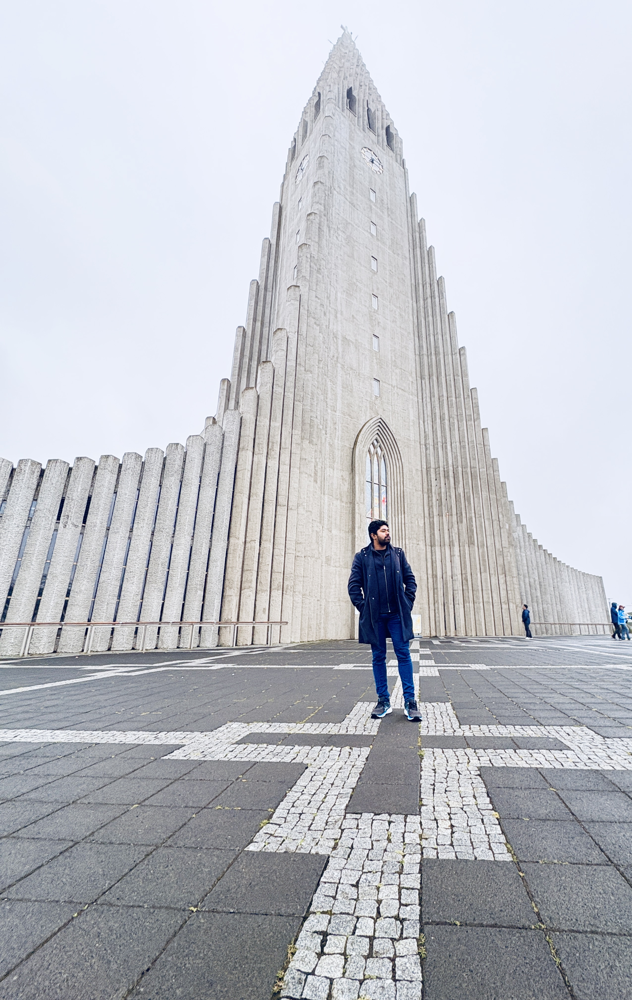
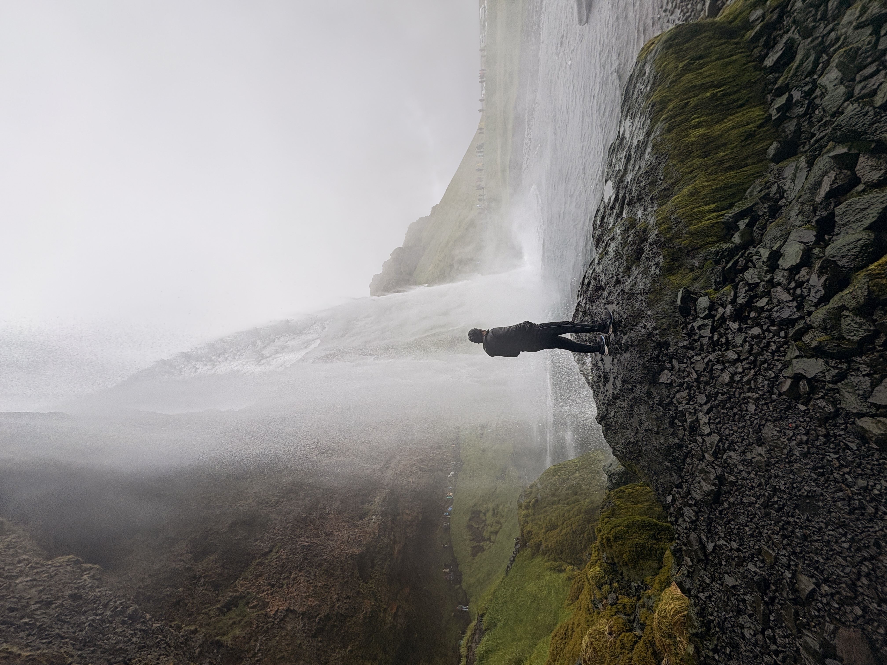
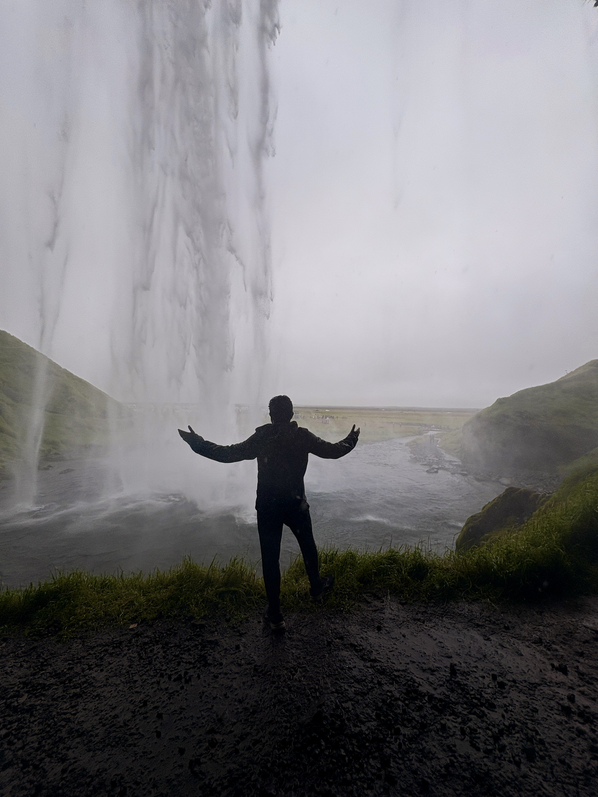

<link rel="stylesheet" href="iceland.css">
<link rel="preconnect" href="https://fonts.googleapis.com">
<link href="https://fonts.googleapis.com/css2?family=Playfair+Display:ital,wght@0,700;0,900;1,700&family=Lora:ital,wght@0,400;0,500;1,400&family=DM+Sans:wght@400;500;600&display=swap" rel="stylesheet">

  <!-- ═══════════════════════════════════════════
       HERO
  ═══════════════════════════════════════════ -->
  <header class="ic-hero">
    
August 2025 · Campervan Journey

    <h1 class="ic-hero__title">Iceland</h1>
    
Seven days. One campervan. An entire island of fire and ice.

    

      
7Days

      

      
~2 400km driven

      

      
∞Waterfalls

    

  </header>

  <!-- intro prose -->
  

    
In August 2025, we took a week-long campervan trip around Iceland — from <em>Golden Circle hot springs</em> to <em>South Coast waterfalls</em>, <em>glacier lagoons</em>, <em>Eastfjords fishing villages</em>, and the <em>wildlife of the north and Snæfellsnes</em>.

    
It was seven days of drone flights, hot river soaks, black sand beaches, endless waterfalls, and fresh fish dinners — each day with its own theme and adventure. Here's our day-by-day itinerary and the highlights that made this trip unforgettable.

  

  <!-- ═══════════════════════════════════════════
       TIMELINE
  ═══════════════════════════════════════════ -->
  

    <!-- ──────────────── DAY 1 ──────────────── -->
    <article class="ic-day" id="day-1">
      

        

        

      

      

        

          Day 1
          <h2 class="ic-day__title">Arrival in Iceland 🚐✈️</h2>
          
Getting settled, stocking up, hitting the road.

        

        
We landed in Keflavík in the afternoon, picked up our campervan from <a href="https://www.starcarrental.is/" target="_blank" class="ic-link">Star Car Rental</a>, and began our journey. The first day was all about getting settled, stocking up on essentials, and preparing for the road ahead.

        

          

            
📍

            

              <h3 class="ic-stop__name">Keflavík Airport</h3>
              
Collected the campervan, completed the checks and paperwork. The adventure officially begins.

            

          

          

            
🏛️

            

              <h3 class="ic-stop__name">Reykjavík</h3>
              
Visited Hallgrímskirkja Church and the colourful Skólavörðustígur Rainbow Street.

              

                <figure class="ic-fig">
                  
                  <figcaption>Hallgrímskirkja</figcaption>
                </figure>
                <figure class="ic-fig">
                  
                  <figcaption>Skólavörðustígur Rainbow Street</figcaption>
                </figure>
              

            

          

          

            
🛒

            

              <h3 class="ic-stop__name">Bónus Supermarket</h3>
              
Stocked up on essentials — oil, salt, pasta sauce, cookies. One of Iceland's cheapest supermarkets, sometimes with free coffee or hot chocolate at the entrance.

            

          

          

            
🏕️

            

              <h3 class="ic-stop__name">Happy Campsite, Keflavík Night 1</h3>
              
Our first overnight stop, just a short drive from the airport. Booked via <a href="https://parka.is/happycampsitekeflavik/" target="_blank" class="ic-link">Parka</a>.

              <figure class="ic-fig ic-fig--wide">
                
                <figcaption>Scenic routes from airport to campsite</figcaption>
              </figure>
            

          

        
<!-- /ic-stops -->
      
<!-- /ic-day__body -->
    </article>
    <!-- ──────────────── DAY 2 ──────────────── -->
    <article class="ic-day" id="day-2">
      

        

        

      

      

        

          Day 2
          <h2 class="ic-day__title">Hot Rivers &amp; Golden Circle 🌊♨️</h2>
          
Geothermal wonders, powerful waterfalls, and our first hot spring soak.

        

        
On our second day, we set out early to explore Iceland's famous Golden Circle and enjoy our first natural hot spring soak. The day was packed with geothermal wonders, powerful waterfalls, and scenic drives.

        

          

            
🌋

            

              <h3 class="ic-stop__name">Sunnumörk Shopping Center, Hveragerði</h3>
              
Our first stop — a shopping mall where the Eurasian and North American tectonic plates meet beneath your feet.

              <figure class="ic-fig">
                
                <figcaption>Sunnumörk Shopping Center in Hveragerði</figcaption>
              </figure>
            

          

          

            
♨️

            

              <h3 class="ic-stop__name">Reykjadalur Hot River</h3>
              
A 1.5 hr hike up through steaming valleys, rewarded with a long soak in a naturally heated river. Unmissable.

              

                <figure class="ic-fig">
                  
                </figure>
                <figure class="ic-fig">
                  
                  <figcaption>Reykjadalur Hot River hike</figcaption>
                </figure>
              

            

          

          

            
💙

            

              <h3 class="ic-stop__name">Brúarfoss</h3>
              
A striking turquoise-blue waterfall tucked away along the Golden Circle route — far fewer crowds than the main stops.

              <figure class="ic-fig ic-fig--wide">
                
                <figcaption>Brúarfoss Waterfall</figcaption>
              </figure>
            

          

          

            
🌊

            

              <h3 class="ic-stop__name">Gullfoss</h3>
              
The mighty Golden Falls — one of Iceland's most iconic waterfalls, roaring through a deep canyon.

              <figure class="ic-fig ic-fig--wide">
                <video autoplay muted loop playsinline>
                  <source src="gullfoss.mov" type="video/quicktime">
                  <source src="gullfoss.mp4" type="video/mp4">
                </video>
                <figcaption>Gullfoss Waterfall</figcaption>
              </figure>
            

          

          

            
💨

            

              <h3 class="ic-stop__name">Geysir Geothermal Area</h3>
              
Watched Strokkur erupt every few minutes, shooting boiling water high into the cool Icelandic air.

              <figure class="ic-fig ic-fig--wide">
                <video autoplay muted loop playsinline>
                  <source src="geysir.mov" type="video/quicktime">
                  <source src="geysir.mp4" type="video/mp4">
                </video>
                <figcaption>Strokkur Geyser</figcaption>
              </figure>
            

          

          

            
🏕️

            

              <h3 class="ic-stop__name">Hellishólar Campsite Night 2</h3>
              
No pre-booking required — just go to the reception and book a spot on arrival.

            

          

        

        

          💡
          
<strong>Tips:</strong> Start Reykjadalur early to beat the crowds and bring quick-dry clothes for the hot river. For Gullfoss and Geysir, late afternoon has far fewer tour buses.

        

      

    </article>
    <!-- ──────────────── DAY 3 ──────────────── -->
    <article class="ic-day" id="day-3">
      

        

        

      

      

        

          Day 3
          <h2 class="ic-day__title">South Coast Waterfalls &amp; Black Beaches 🏞️</h2>
          
The most photogenic day of the trip — waterfalls, arches, and dramatic black sand.

        

        
Day 3 took us along Iceland's dramatic South Coast — home to some of the country's most famous waterfalls and black sand beaches. Plenty of chances to fly the drone and capture Iceland's iconic landscapes.

        

          

            
🌊

            

              <h3 class="ic-stop__name">Seljalandsfoss</h3>
              
The waterfall you can walk <em>behind</em> — an unforgettable experience, but prepare to get thoroughly soaked!

              <!-- Slideshow -->
              

                

                  
                

                

                  
                

                

                  
                

                

                  
                

                <button class="ic-slide__btn ic-slide__btn--prev" onclick="moveSlide('slideshow-sela',-1)" aria-label="Previous">&#8249;</button>
                <button class="ic-slide__btn ic-slide__btn--next" onclick="moveSlide('slideshow-sela', 1)" aria-label="Next">&#8250;</button>
                

                <figcaption class="ic-slide__caption">Seljalandsfoss</figcaption>
              

            

          

          

            
🏔️

            

              <h3 class="ic-stop__name">Gljúfrabúi</h3>
              
A hidden canyon waterfall just a few minutes' walk from Seljalandsfoss — most tourists walk straight past it.

              <figure class="ic-fig ic-fig--wide">
                
                <figcaption>Gljúfrabúi tucked inside a canyon</figcaption>
              </figure>
            

          

          

            
🌈

            

              <h3 class="ic-stop__name">Skógafoss</h3>
              
One of Iceland's most famous waterfalls, with rainbows appearing almost constantly in the mist on sunny days.

              <figure class="ic-fig ic-fig--wide">
                
                <figcaption>Skógafoss in the morning light</figcaption>
              </figure>
            

          

          

            
🦜

            

              <h3 class="ic-stop__name">Dyrhólaey Arch</h3>
              
Dramatic coastal cliffs and a massive sea arch, with puffins nesting in the rocks in summer.

              <figure class="ic-fig ic-fig--wide">
                
                <figcaption>Dyrhólaey arch and cliffs</figcaption>
              </figure>
            

          

          

            
⚫

            

              <h3 class="ic-stop__name">Reynisfjara Black Sand Beach</h3>
              
Famous for its basalt columns and roaring Atlantic waves. <strong>Never turn your back to the sea here</strong> — the sneaker waves are deadly.

              <figure class="ic-fig ic-fig--wide">
                
                <figcaption>Reynisfjara's black sands and sea stacks</figcaption>
              </figure>
            

          

          

            
🏕️

            

              <h3 class="ic-stop__name">Vík Campsite Night 3</h3>
              
A convenient stop with views of cliffs and sea stacks in the distance.

            

          

        

        

          💡
          
<strong>Tips:</strong> Bring full waterproof gear for Seljalandsfoss. Visit Reynisfjara early or late — both for smaller crowds and to stay extra vigilant about the waves.

        

      

    </article>
     <article class="ic-day" id="day-4">
     </article>

  
<!-- /ic-timeline -->

<!-- /ic-wrap -->

