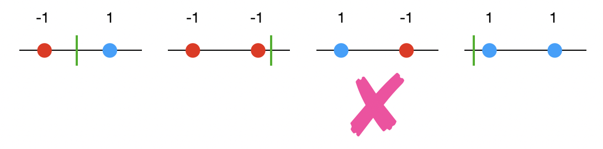

This is the first part of the <a href="/blog/vc-nn/">VC Dimension and Neural Networks</a> series. Basic definition and some examples of vc dimension of learning algorithms are explained here.

## 1. Definition

Let $S=\{x_1,x_2,\cdots,x_m\}$ be the set of m random points from $\mathbb{R}^d$ and $\mathscr{H}$ be a class of $\{-1,+1\}$ valued functions on $\mathbb{R}^d$ i.e $$\forall \\, h \in H, h:S \to \{0,1\}^m$$ One such example is $h_1(x_i)=1 \,\forall \, x_i \in S$. In the context of Machine Learning, $\mathscr{H}$ is the learning algorithm generally used for any classification task such as Logistic Regression etc. For each parameter $\theta$ in Logistic Regression we get $h(\theta;x) \in \mathscr{H}$.

$\textbf{Shattering:}$ $S$ is shattered by $\mathscr{H}$ when all labeling of $S$ (with 0 and 1) can be computed by $\mathscr{H}$ i.e for all labeling of $S$ denoted by $Y=\{0,1\}^m$, $\exists \\, h\in \mathscr{H}$ such that the $\sum_{i}|h(x_i)-y_i|=0$, where $y_i$ is the label of the ith point. Consider in Figure 1, $S$ is the set of three points, $\mathscr{H}=\{wx+b;w,b\in \mathbb{R}\}$, for every possible labels of $S$ (colors of $S$), there is a line which achieves the classification task. So $\mathscr{H}=\{wx+b;w,b\in \mathbb{R}\}$ shatters $S$ (from Figure 1).
<figure>
					
 

					<figcaption style= "text-align:center">Figure 1:  Shattering of 3 points in xy plane by lines. Red is for negative label and blue for positive label.
					</figcaption>
				</figure>

 $\textbf{Vapnik-Chervonenkis (VC) dimension}$ of a hypothesis space($\mathscr{H}$) is the cardinality of the largest $S$ such that $\mathscr{H}$ shatters $S$. If $VC(\mathscr{H})=n$, there there exists $n$ points which can be shattered by $\mathscr{H}$ but no set of $(n+1)$ points can be shattered.

## 2. VC-dimension of class of Thresholds
<figure>
					
 

					<figcaption style= "text-align:center">Figure 1:  Shattering of 2 points a class of threhsolds. Red is for negative label and blue for positive label. The green bar is the threshold. For third example, there is no hypothesis which can predict the two points.
					</figcaption>
				</figure>
				
## 3. VC-dimension of class of Intervals
## 4. VC-dimension of class of axis-aligned rectangles
## 5. VC-dimension of class of 2d Line
## 6. VC-dimension of class of hyperplane

